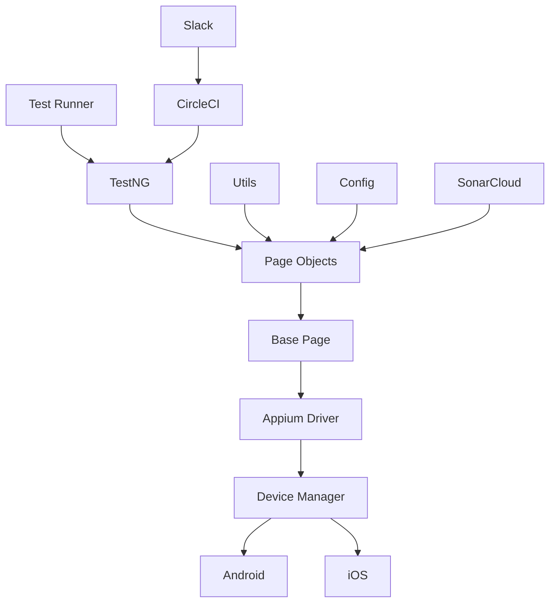

# 🚀 Mobile Automation Framework

<div align="center">

[](https://www.oracle.com/java/)
[](https://appium.io/)
[](https://testng.org/)
[](https://maven.apache.org/)
[](LICENSE)
[](https://circleci.com/gh/yourusername/mobile-automation)
[](https://sonarcloud.io/dashboard?id=your-org-mobile-automation)


A robust, scalable, and maintainable mobile automation framework built with Java, Appium, and TestNG.

[Features](#features) • [Getting Started](#getting-started) • [Architecture](#architecture) • [Contributing](#contributing)

</div>

## 🌟 Features

- 🔄 **Cross-Platform Support**
  - Android & iOS automation
  - Physical devices & emulators/simulators
  - Parallel test execution

- 🛠️ **Modern Architecture**
  - Page Object Model
  - Factory Pattern
  - Builder Pattern
  - Custom annotations

- 📊 **Comprehensive Reporting**
  - ChainTest Reports
  - Screenshots & videos
  - Test analytics
  - Performance metrics

- 🔒 **Security**
  - Encrypted credentials
  - Environment-based configuration
  - Secure device management

- 🚀 **CI/CD Integration**
  - CircleCI pipeline
  - GitHub Actions
  - Docker support
  - Automated Slack reporting

- 📈 **Code Quality**
  - SonarCloud integration
  - SonarLint support
  - Code coverage tracking
  - Quality gates

## 🏗️ Architecture



## 🚀 Getting Started

### Prerequisites

- Java 11 or higher
- Maven 3.8.4 or higher
- Appium 2.0 or higher
- Android SDK (for Android testing)
- Xcode (for iOS testing)
- Node.js 14 or higher
- SonarLint IDE plugin
- iOS Simulator or physical device (for iOS testing)

### Installation

1. Clone the repository:
   ```bash
   git clone https://github.com/yogeshwankhede007/mobile-automation-framework-cursor-ai.git
   cd mobile-automation
   ```

2. Install dependencies:
   ```bash
   mvn clean install
   ```

3. Install Appium:
   ```bash
   npm install -g appium
   ```

4. Install Appium drivers:
   ```bash
   appium driver install uiautomator2
   appium driver install xcuitest
   ```

5. For iOS testing:
   ```bash
   # Install WebDriverAgent
   npm install -g appium-wda
   
   # Install Xcode Command Line Tools
   xcode-select --install
   
   # Install Carthage
   brew install carthage
   ```

6. Configure SonarLint:
   - Install SonarLint plugin in your IDE
   - Bind project to SonarCloud
   - Update project settings

### Configuration

1. Update `src/test/resources/config.properties`:
   ```properties
   # Platform Configuration
   platform=ios
   
   # App Configuration
   ios.app.name=your_app.app
   ios.bundle.id=com.your.app.bundleid
   
   # Device Configuration
   ios.device.name=iPhone 12
   ios.os.version=15.0
   ```

2. Place your app files in the root `apps` directory:
   - iOS: `apps/your_app.app`

### Running Tests

1. **Local Execution**:
   ```bash
   # Run tests on iOS
   mvn clean test -DsuiteXmlFile=src/test/suites/regression.xml -Dplatform=ios
   
   # Run specific test on iOS
   mvn clean test -DsuiteXmlFile=src/test/suites/individual.xml -Dtest=LoginTest#testValidLogin -Dplatform=ios
   ```

2. **With Sonar Analysis**:
   ```bash
   mvn clean verify sonar:sonar
   ```

3. **CircleCI Pipeline**:
   - Push to main branch or create PR
   - Pipeline runs automatically
   - Results sent to Slack

## 📊 Code Quality

### SonarCloud Integration

- Automatic code analysis on every PR
- Quality gates for code coverage and issues
- Security hotspot detection
- Technical debt tracking

### SonarLint Setup

1. Install SonarLint plugin
2. Configure project binding:
   ```json
   {
     "serverUrl": "https://sonarcloud.io",
     "organizationKey": "your-org",
     "projectKey": "your-org-mobile-automation"
   }
   ```

3. Update project settings in IDE

## 🔄 CI/CD Pipeline

### CircleCI Configuration

- Automated test execution
- Code quality checks
- Test coverage reporting
- Slack notifications
- Scheduled runs (Monday 7 AM)

### Slack Integration

- Test execution results
- Coverage reports
- Failed test details
- Screenshots and videos
- Performance metrics

## 📱 Device Management

The framework automatically detects and manages available devices:

```java
// Example: Running tests on available devices
DeviceManager deviceManager = DeviceManager.getInstance();
deviceManager.detectDevices();
List<DeviceInfo> devices = deviceManager.getAvailableDevices();
```

## 🔧 Customization

### Adding New Pages

```java
public class LoginPage extends BasePage {
    @FindBy(id = "username")
    private MobileElement usernameField;
    
    @FindBy(id = "password")
    private MobileElement passwordField;
    
    public void login(String username, String password) {
        usernameField.sendKeys(username);
        passwordField.sendKeys(password);
        // Additional logic
    }
}
```

### Custom Annotations

```java
@Retention(RetentionPolicy.RUNTIME)
@Target({ElementType.METHOD})
public @interface RetryCount {
    int value() default 3;
}
```

## 📊 Reports

Test reports are generated in the root `run_reports` directory with dynamic names based on the test suite:
- Regression Tests: `run_reports/regression_YYYY-MM-DD_HH-mm-ss/regression.html`
- Smoke Tests: `run_reports/smoke_YYYY-MM-DD_HH-mm-ss/smoke.html`
- Login Tests: `run_reports/login_YYYY-MM-DD_HH-mm-ss/login.html`
- Individual Tests: `run_reports/individual_YYYY-MM-DD_HH-mm-ss/individual.html`

Each test run creates a new timestamped directory:
```
run_reports/
└── {{runner}}_YYYY-MM-DD_HH-mm-ss/
    ├── {{runner}}.html
    ├── {{runner}}_summary.html
    ├── {{runner}}_results.txt
    ├── screenshots/
    └── videos/
```

## 🤝 Contributing

1. Fork the repository
2. Create your feature branch (`git checkout -b feature/AmazingFeature`)
3. Commit your changes (`git commit -m 'Add some AmazingFeature'`)
4. Push to the branch (`git push origin feature/AmazingFeature`)
5. Open a Pull Request

## 📝 License

This project is licensed under the MIT License - see the [LICENSE](LICENSE) file for details.

## 🙏 Acknowledgments

- [Appium](https://appium.io/) - Mobile app automation
- [TestNG](https://testng.org/) - Testing framework
- [ChainTest](https://chaintest.com/) - Test reporting
- [SonarCloud](https://sonarcloud.io/) - Code quality analysis
- [CircleCI](https://circleci.com/) - CI/CD platform

## 📞 Support

For support, email yogi.wankhede007@gmail.com.com or join our Slack channel.

---

<div align="center">
Made with ❤️ by [Yogesh Wankhede](https://github.com/yogeshwankhede007)
</div> 
